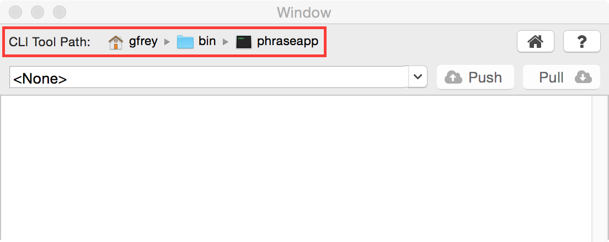
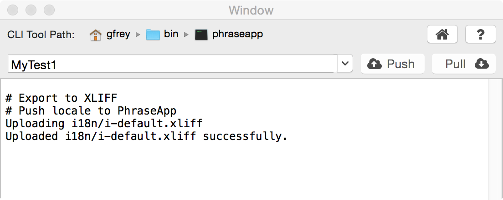

# PhraseApp for Xcode

This plugin integrates [PhraseApp](https://www.phraseapp.com/) into Xcode. Current version is `1.1.0`.

**Please note that plugins are not supported by Xcode 8.** The last version to be supported is **7.3**. For those that have already upgraded, please use the **[PhraseApp CLI tool](https://phraseapp.com/en/cli)** ([Github](https://github.com/phrase/phraseapp-client)). 

There is a chance to rollout a native Mac App or use Xcode Source Editor Extensions in the future. Keep in mind that this is not scheduled or planned yet.

## Installation

Download the latest release from
[Github](https://github.com/phrase/PhraseAppXcode/releases/latest) and unzip
the file in the `~/Library/Application Support/Developer/Shared/Xcode/Plug-ins`
directory (assuming the plugin archive was downloaded to `~/Downloads`):

```
cd ~/Library/Application\ Support/Developer/Shared/Xcode/Plug-ins
unzip ~/Downloads/PhraseAppXcodePlugin.xcplugin.zip
```

After starting Xcode it will ask, whether "the unsafe bundle should be loaded".
It should be. Afterwards you are ready to go. To uninstall, just delete the
plugin from the mentioned path (and restart Xcode).

This is tested on OS X 10.10 with Xcode 7.3.


## Configuration

Open the plugin window first. Click the **Window > PhraseApp** menu entry. The
PhraseApp plugin window will open. From here you can configure the plugin,
select a project, and push and pull locales.

The plugin relies on the [PhraseApp CLI tool](https://phraseapp.com/en/cli) to
be installed. Point the file selector in the top of the plugin window to this
location:



The plugin is going to guess the location, but might fail to do so. If so,
manually select the CLI tool path. The file must be executable and the file
pointed to must have the "phraseapp" prefix.


## Usage

The plugin is actually pretty simple. For each workspace opened in Xcode the
combobox in the plugin window will have an entry. The **Push** and **Pull**
buttons are active if the CLI tool path was properly configured and the project
has a PhraseApp configuration file (named `.phraseapp.yml`) in its root
directory.

On **Push** and **Pull** the respective output will be sent to the text area in
the lower part of the window.



In this example the workspace "MyTest1" was selected and pushed. For a
description of the output generated see the following section.


## Workflow

The internationalization and localization workflow Apple proposes has made the
following steps and assumptions:

* It is assumed that all development is done in one language, English by
  default (this can be changed and is described below in the "Change Default
  Locale" subsection). All strings should be in this language and are considered
  final. It is called the "development language" in the following.
* There is a tool in **Editor > Export For Localization** that will extract all
  strings from user-interface elements (located in storyboards for example) and
  usages of the `NSLocalizedString` macro in code. These strings are collected
  in a `XLIFF` file that can be used to hand over to translators.
* There is of course a function to reimport the translators' results
  into the source code under the **Editor > Import Localizations...** menu
  item. This will read a `XLIFF` file and extract the configured translations.
  The resulting translations are kept in `strings` files for each source of
  strings (storyboards or code that is) and each target locale.

Into this workflow PhraseApp is integrated. Please note, if you don't want to
follow this workflow for whatever reason, the plugin is still usable for you.
Xcode's export and import actions are only triggered if the PhraseApp
configuration contains an `XLIFF` source (and respective targets). So it can be
used with any other configuration too!

The following subsections describe two variants of the XLIFF based workflow.


### The Simple Workflow

The simpler workflow comes with the following limitation: The development
language is only handled in Xcode, i.e. it is not possible for product managers
(or whoever might want to) to change these text fragments directly in
PhraseApp.

There will be a solution for this limitation, but it requires a slightly more
complicated setup, so let's start simple.


#### Configuration

After creating a project make sure you configure **Base Internationalization**
and all required target languages in your project's **Info** configuration
view.

Additionally some files must be generated for the automatic import to work
properly. Use the following command and afterwards add the generated files to
the project within Xcode (clicking the **Add files to "[project name]"...***
point of the projects context menu).

	for locale in <locales>; do
		echo '/* No Localized Strings */' > <project_name>/$locale.lproj/Localizable.strings
		echo '/* No Localized Strings */' > <project_name>/$locale.lproj/InfoPlist.strings
	done

Next we'll need to configure the PhraseApp tools to support export and import
of the strings to be translated. The following example will assume the Xcode
export and import will use the `i18n` directory to place and find the `xliff`
files. The development language is assumed to be English. Make sure you replace
the placeholders (in square brackets) for `access_token`, `project_id` and
`locale_id` with the respective values of your setup. Put this template into
the `.phraseapp.yml` file into your project's root directory.

	phraseapp:
	  access_token: [access_token]
	  project_id: [project_id]
	  push:
	    sources:
	    - file: i18n/en.xliff
	      params:
	        locale_id: [locale_id]
	        file_format: xlf
	        update_translations: true
	  pull:
	    targets:
	    - file: i18n/<locale_name>.xliff
	      params:
	        file_format: xlf
	    - file: [project_name]/<locale_name>.lproj/Localizable.stringsdict
	      params:
	        file_format: stringsdict

With this configuration in place the project is ready to use with PhraseApp, as
described in the next subsection.


#### Usage

If you're using PhraseApp's Xcode plugin the export and import is as easy as
opening the PhraseApp window from **Window > PhraseApp**, selecting the
respective project from the dropdown, and using the **Push** or **Pull**
button.

If you want to use the command line for a more manual approach or integration
into some build tool use the following steps for export:

	xcodebuild -exportLocalizations -localizationPath i18n
	phraseapp push

And for import of the given locales (`de`, `es`, and `fr` in this example):

	phraseapp pull
	for locale in de es fr; do xcodebuild -importLocalizations -localizationPath i18n/$locale.xliff; done

Keep in mind that changing strings in the default locale in PhraseApp will
result in disaster. It must be convention to never change these values in
PhraseApp, but only in the code itself. The effect would be that Xcode doesn't
import those strings any more (mismatch between source locale string in
the `XLIFF` file and the string in the code).

If you want to pluralize a key, this is possible by setting the according flag
on the key and providing the basic translations. The resulting translated
pluralizations are pulled into `.stringsdict` files. For more complicated
pluralization features it might be necessary to also push the source locale's
`.stringsdict` file.


### The Manage All Keys In PhraseApp Workflow

This is a more advanced workflow that will allow to change strings from the
development language in PhraseApp.

This requires some additional steps as we must make sure the development
language doesn't block the layering of different locales, like keys should be
taken from the most specific locale, like en-US first, then general en and last
from the development locale. We'll introduce an artificial locale for this.


#### Change Default Locale

Close the project in Xcode and open up a terminal window. Go to the projects
root folder and edit the following two files:

* `<project_name>/Info.plist`: set the `CFBundleDevelopmentRegion` variable to
  `i-default`.
* `<project_name>.xcodeproj/project.pbxproj`: change the `en` item of the
  `knownRegions` list to `i-default`. Change the `developmentRegion` value from
  `en` to `i-default`. (see http://eschatologist.net/blog/?p=224 ).

Open the project again.


#### Configuration

This configuration will use the new base locale. Everything else is unchanged.
The base locale in PhraseApp should be named (aka `locale_name`) "i-default"
and have the locale-code "en". Having multiple locales with the same code is
perfectly fine.

	phraseapp:
	  access_token: [access_token]
	  project_id: [project_id]
	  push:
	    sources:
	    - file: i18n/i-default.xliff
	      params:
	        locale_id: [locale_id]
	        file_format: xlf
	        update_translations: true
	  pull:
	    targets:
	    - file: i18n/<locale_name>.xliff
	      params:
	        file_format: xlf
	    - file: [project_name]/<locale_name>.lproj/Localizable.stringsdict
	      params:
	        file_format: stringsdict


#### Usage

Again everything within the "i-default" locale should be considered fixed in
PhraseApp and never be changed. After pushing the keys to PhraseApp the product
manager needs to approve the translations, by moving them to the "standard"
locale (like "en" in the given example). Translators must base their work on
this verified locale. Everything else is analogous to the simple workflow.


### Output Of Actions

There are some errors that might appear when importing XLIFF files pulled from
PhraseApp. Let's see an example:

	# Pull locales from PhraseApp
	Downloaded de to i18n/de.xliff
	
	# Import from XLIFF: i18n/de.xliff
	MyTest1/Base.lproj/Main.storyboard: Incoming development string "Master2" does not match "Master" (Key: "RMx-3f-FxP.title")
	global: File not found in the project

This happened when importing the German translations from the `de.xliff` file.
Two messages appear:

* The `Incoming development string "Master2" does not match "Master"` message
  is serious. This is an indicator for a translation in the development locale
  being changed in PhraseApp. To fix go to PhraseApp and revert changes to the
  named key.
* The `File not found in the project` message isn't that serious and happens
  when keys are added from something different than the development language
  (like adding keys in PhraseApp or push different files from other projects).

